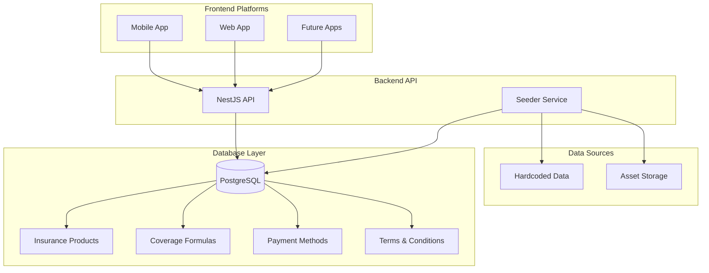

# Design Document

## Overview

This design outlines the migration of hardcoded insurance product data from the mobile application to a centralized backend database system. The solution includes enhanced database entities, comprehensive API endpoints, and a robust seeder service that ensures data consistency across all platforms.

The migration will transform static JavaScript objects into dynamic database records, enabling real-time updates, better data management, and consistent product information across mobile, web, and future platforms.

## Architecture

### High-Level Architecture



### Data Flow

1. **Initialization Phase**: Seeder service reads hardcoded data and populates database
2. **Runtime Phase**: Platforms request data through API endpoints
3. **Update Phase**: Administrators can refresh data through seeder service

## Components and Interfaces

### Enhanced Database Entities

#### InsuranceProduct Entity
```typescript
@Entity('insurance_products')
export class InsuranceProduct {
  @PrimaryGeneratedColumn()
  id: number;

  @Column()
  title: string;

  @Column('text')
  description: string;

  @Column({ type: 'enum', enum: ProductType })
  productType: ProductType;

  @Column({ type: 'enum', enum: ClientType })
  clientType: ClientType;

  @Column({ nullable: true })
  price: string;

  @Column({ nullable: true })
  iconUrl: string;

  @Column({ nullable: true })
  backgroundUrl: string;

  @Column({ nullable: true })
  coverageLink: string;

  @Column('simple-array', { nullable: true })
  coverage: string[];

  @Column('simple-array', { nullable: true })
  extraFields: string[];

  @Column()
  color: string;

  @OneToMany(() => CoverageFormula, formula => formula.product)
  formulas: CoverageFormula[];
}
```

#### CoverageFormula Entity
```typescript
@Entity('coverage_formulas')
export class CoverageFormula {
  @PrimaryGeneratedColumn()
  id: number;

  @Column()
  type: string; // "Formule Tiers", "Formule Tiers Essentiel", etc.

  @Column('simple-array')
  coverage: string[];

  @Column()
  price: string;

  @Column('text')
  description: string;

  @Column()
  category: string; // CV range category

  @Column({ nullable: true })
  iconUrl: string;

  @Column({ nullable: true })
  coverageLink: string;

  @ManyToOne(() => InsuranceProduct, product => product.formulas)
  product: InsuranceProduct;
}
```

#### PaymentMethod Entity
```typescript
@Entity('payment_methods')
export class PaymentMethod {
  @PrimaryGeneratedColumn()
  id: number;

  @Column()
  title: string;

  @Column()
  serviceCode: string;

  @Column()
  validationCall: string;

  @Column({ default: true })
  isActive: boolean;
}
```

#### TermsAndConditions Entity
```typescript
@Entity('terms_conditions')
export class TermsAndConditions {
  @PrimaryGeneratedColumn()
  id: number;

  @Column()
  title: string;

  @Column('text')
  description: string;

  @Column('json')
  content: TermsContent[];

  @Column({ default: true })
  isActive: boolean;

  @Column({ type: 'timestamp', default: () => 'CURRENT_TIMESTAMP' })
  createdAt: Date;
}
```

### API Endpoints

#### Product Management Endpoints
- `GET /api/v2/products` - Get all insurance products with filtering
- `GET /api/v2/products/:id` - Get specific product details
- `GET /api/v2/products/:id/formulas` - Get coverage formulas for a product
- `GET /api/v2/products/search` - Search products with advanced filters

#### Configuration Endpoints
- `GET /api/v2/payment-methods` - Get available payment methods
- `GET /api/v2/terms-conditions` - Get current terms and conditions
- `GET /api/v2/config/colors` - Get brand colors and themes

#### Administrative Endpoints
- `POST /api/v2/admin/seed` - Trigger data seeding process
- `GET /api/v2/admin/seed/status` - Get seeding status and logs

### Seeder Service Interface

```typescript
interface SeederService {
  seedAll(): Promise<SeederResult>;
  seedInsuranceProducts(): Promise<SeederResult>;
  seedCoverageFormulas(): Promise<SeederResult>;
  seedPaymentMethods(): Promise<SeederResult>;
  seedTermsAndConditions(): Promise<SeederResult>;
  validateData(): Promise<ValidationResult>;
}

interface SeederResult {
  success: boolean;
  created: number;
  updated: number;
  errors: string[];
  duration: number;
}
```

## Data Models

### Product Type Enumeration
```typescript
enum ProductType {
  AUTO = 'AUTO',
  MOTO = 'MOTO',
  MULTIRISK_PRO = 'MULTIRISK_PRO',
  IAC = 'IAC',
  HEALTH = 'HEALTH',
  TRAVEL = 'TRAVEL',
  TRANSPORT = 'TRANSPORT',
  TECHNICAL_RISKS = 'TECHNICAL_RISKS',
  RC_SCOLAIRE = 'RC_SCOLAIRE',
  LEGACY = 'LEGACY'
}
```

### Client Type Enumeration
```typescript
enum ClientType {
  INDIVIDUAL = 1,    // Particuliers
  ENTERPRISE = 2,    // Entreprise
  BOTH = 3          // Both individual and enterprise
}
```

### Data Transformation Mapping

#### Insurance Packages Mapping
```typescript
// From: InsurancePacks array in mobile app
// To: InsuranceProduct entities
const packageMapping = {
  id: 'id',
  title: 'title', 
  desc: 'description',
  type: 'productType', // Convert "package"/"Produit" to enum
  clientType: 'clientType', // Default to BOTH if not specified
  color: 'color',
  coverage: 'coverage',
  price: 'price',
  // Asset handling for icons and backgrounds
  icon: 'iconUrl', // Convert require() paths to URLs
  bg: 'backgroundUrl',
  coverageLink: 'coverageLink'
};
```

#### Coverage Formulas Mapping
```typescript
// From: COVERAGES_AUTO and COVERAGES_MULTI arrays
// To: CoverageFormula entities with product relationships
const formulaMapping = {
  id: 'id',
  type: 'type',
  coverage: 'coverage',
  price: 'price',
  description: 'description',
  category: 'category',
  icon: 'iconUrl',
  coverageLink: 'coverageLink'
  // Establish relationship with parent product
};
```

## Correctness Properties

*A property is a characteristic or behavior that should hold true across all valid executions of a system-essentially, a formal statement about what the system should do. Properties serve as the bridge between human-readable specifications and machine-verifiable correctness guarantees.*

### Property Reflection

After reviewing all identified properties, several can be consolidated to eliminate redundancy:

- Properties 1.1-1.5 (data seeding) can be combined into a comprehensive seeding property
- Properties 2.1-2.5 (API endpoints) can be combined into API functionality properties  
- Properties 3.1-3.5 (seeder service) represent distinct behaviors and should remain separate
- Properties 4.1-4.5 (data model) can be combined into data completeness properties
- Properties 5.1-5.5 (asset handling) can be combined into asset processing properties
- Properties 6.1-6.3, 6.5 (backward compatibility) can be combined
- Properties 7.1-7.5 (logging) can be combined into logging completeness properties
- Properties 8.1-8.5 (search functionality) can be combined into search filtering properties

Property 1: Complete data seeding
*For any* seeder execution, all hardcoded data categories (insurance packages, auto coverages, multirisque coverages, payment methods, terms and conditions) should be successfully migrated to the database with correct data integrity
**Validates: Requirements 1.1, 1.2, 1.3, 1.4, 1.5**

Property 2: API endpoint completeness  
*For any* valid API request, the system should return complete and accurate data for insurance packages, coverage formulas, payment methods, terms and conditions, and product details
**Validates: Requirements 2.1, 2.2, 2.3, 2.4, 2.5**

Property 3: Seeder idempotency
*For any* repeated seeder execution, the system should check for existing data and avoid creating duplicates while updating existing records appropriately
**Validates: Requirements 3.1, 3.2**

Property 4: Seeder logging and error handling
*For any* seeder execution, the system should log progress, handle errors gracefully with rollback, and validate data before insertion
**Validates: Requirements 3.3, 3.4, 3.5**

Property 5: Data model completeness
*For any* stored insurance product or coverage formula, all required fields (product type, client type, metadata, pricing, relationships) should be properly populated and maintained
**Validates: Requirements 4.1, 4.2, 4.3, 4.4, 4.5**

Property 6: Asset processing reliability
*For any* asset reference in the source data, the system should convert paths to accessible URLs, validate external links, and handle missing assets gracefully
**Validates: Requirements 5.1, 5.2, 5.3, 5.4, 5.5**

Property 7: Backward compatibility preservation
*For any* existing API endpoint or data structure, the system should maintain compatibility with existing integrations while supporting new features
**Validates: Requirements 6.1, 6.2, 6.3, 6.5**

Property 8: Comprehensive logging
*For any* seeder operation, the system should log start/completion events, progress updates, errors, and validation failures with appropriate detail
**Validates: Requirements 7.1, 7.2, 7.3, 7.4, 7.5**

Property 9: Search filtering accuracy
*For any* search request with filtering criteria (product type, client type, price range, coverage features), the system should return only products that match all specified criteria
**Validates: Requirements 8.1, 8.2, 8.3, 8.4, 8.5**

## Error Handling

### Seeder Service Error Handling
- **Data Validation Errors**: Log specific validation failures and continue processing other records
- **Database Connection Errors**: Retry with exponential backoff, fail gracefully if persistent
- **Asset Processing Errors**: Log warnings for missing assets but continue seeding process
- **Transaction Failures**: Rollback partial changes and maintain database integrity

### API Error Handling
- **Invalid Product IDs**: Return 404 with descriptive error message
- **Malformed Requests**: Return 400 with validation error details
- **Database Unavailable**: Return 503 with retry-after header
- **Search Timeout**: Return partial results with timeout indicator

### Data Integrity Safeguards
- **Foreign Key Constraints**: Ensure coverage formulas are properly linked to products
- **Enum Validation**: Validate product types and client types against defined enums
- **Price Format Validation**: Ensure price strings follow expected format patterns
- **URL Validation**: Verify asset URLs are properly formatted and accessible

## Testing Strategy

### Unit Testing Approach
- Test individual seeder methods for each data category
- Test API endpoints with various input scenarios
- Test data validation functions with valid and invalid inputs
- Test error handling with simulated failure conditions
- Test asset processing with different path formats

### Property-Based Testing Approach
The testing strategy will use **Hypothesis** (Python) for property-based testing, configured to run a minimum of 100 iterations per property test.

Each property-based test will be tagged with comments explicitly referencing the correctness property from this design document using the format: **Feature: data-migration-backend, Property {number}: {property_text}**

Property-based tests will:
- Generate random product data and verify seeding consistency
- Generate various API request patterns and verify response completeness
- Test seeder idempotency with multiple execution scenarios
- Verify data model completeness across different product types
- Test asset processing with various path formats and missing assets
- Verify backward compatibility with different API request formats
- Test search filtering with random criteria combinations

### Integration Testing
- Test complete seeder workflow from start to finish
- Test API endpoints with real database interactions
- Test cross-platform compatibility with mobile and web clients
- Test performance with large datasets
- Test concurrent access scenarios

### Database Testing
- Test migration scripts and schema changes
- Test data integrity constraints and relationships
- Test backup and restore procedures
- Test performance with indexed queries

## Performance Considerations

### Database Optimization
- **Indexing Strategy**: Create indexes on frequently queried fields (product_type, client_type, price ranges)
- **Query Optimization**: Use efficient joins for product-formula relationships
- **Connection Pooling**: Configure appropriate database connection pools for concurrent access
- **Caching Strategy**: Implement Redis caching for frequently accessed product data

### API Performance
- **Response Pagination**: Implement pagination for large product lists
- **Field Selection**: Allow clients to specify which fields to return
- **Compression**: Enable gzip compression for API responses
- **Rate Limiting**: Implement rate limiting to prevent API abuse

### Seeder Performance
- **Batch Processing**: Process data in batches to reduce memory usage
- **Parallel Processing**: Use worker threads for independent data categories
- **Progress Tracking**: Provide progress indicators for long-running operations
- **Incremental Updates**: Support incremental seeding for partial updates

## Security Considerations

### Data Protection
- **Input Validation**: Sanitize all input data to prevent injection attacks
- **Access Control**: Restrict seeder endpoints to authenticated administrators
- **Audit Logging**: Log all administrative operations for security auditing
- **Data Encryption**: Encrypt sensitive configuration data at rest

### API Security
- **Authentication**: Require valid API keys for all endpoints
- **Authorization**: Implement role-based access control for administrative functions
- **HTTPS Only**: Enforce HTTPS for all API communications
- **CORS Configuration**: Configure appropriate CORS policies for web clients

## Deployment Strategy

### Database Migration
1. **Schema Updates**: Deploy new entity schemas with backward compatibility
2. **Data Migration**: Run seeder service to populate new tables
3. **Validation**: Verify data integrity and completeness
4. **Cleanup**: Remove deprecated data structures after validation

### API Deployment
1. **Versioned Endpoints**: Deploy new API endpoints alongside existing ones
2. **Feature Flags**: Use feature flags to control new functionality rollout
3. **Monitoring**: Implement comprehensive monitoring and alerting
4. **Rollback Plan**: Maintain ability to rollback to previous API version

### Platform Updates
1. **Mobile App**: Update to use new API endpoints while maintaining fallbacks
2. **Web Platform**: Implement new product data consumption patterns
3. **Testing**: Comprehensive testing across all platforms before release
4. **Gradual Rollout**: Phased rollout to minimize risk of issues